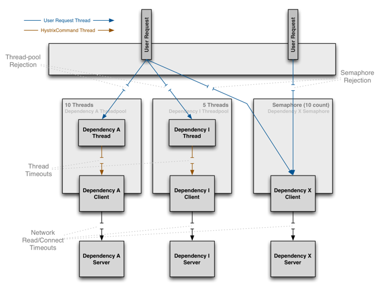

[Configuration](https://github.com/Netflix/Hystrix/wiki/Configuration)
===
## 内容
<!-- toc -->
## 介绍
Hystrix使用 [Archaius](https://github.com/Netflix/archaius) 作为配置的默认实现属性。

下面的文档描述了使用Hystrix默认属性的策略实现，除非你通过使用插件来覆盖它。

每个属性有四个优先级别：

1. 从代码配置全局默认
如果未设置以下3中的任何一个，则这是默认值。全局默认值在下表中显示为“默认值”。

2. 动态全局默认属性
您可以使用属性更改全局默认值。全局默认属性名称在下表中显示为“默认属性”。

3. 从代码配置实例的默认属性
您可以定义特定于实例的默认值。 例：

```java
HystrixCommandProperties.Setter().withExecutionTimeoutInMilliseconds(int value)
```

您将以类似于以下方式将此类命令插入HystrixCommand构造函数：

```java
public HystrixCommandInstance(int id) {
    super(Setter.withGroupKey(HystrixCommandGroupKey.Factory.asKey("ExampleGroup"))
        .andCommandPropertiesDefaults(HystrixCommandProperties.Setter()
               .withExecutionTimeoutInMilliseconds(500)));
    this.id = id;
}
```

有常用的初始值的方便构造函数。 这里有一个例子：

```java
public HystrixCommandInstance(int id) {
    super(HystrixCommandGroupKey.Factory.asKey("ExampleGroup"), 500);
    this.id = id;
}
```

4. 动态实例属性

您可以动态设置实例特定值，覆盖前面的三个默认值。动态实例属性名称在下表中显示为“实例属性”。
例如：

  instance property |  hystrix.command.HystrixCommandKey.execution.isolation.thread.timeoutInMilliseconds
 -----|------
 |
将属性的Hystrix命令键部分替换为您要定位的HystrixCommand的Hystrix命令Key.name（）值。

例如，如果键被命名为“SubscriberGetAccount”，则属性名称将为
>hystrix.command.SubscriberGetAccount.execution.isolation.thread.timeoutInMilliseconds

## 命令的属性
[查看原文表格](https://github.com/Netflix/Hystrix/wiki/Configuration#command-properties)

### Execution（执行器）

以下属性控制 *HystrixCommand.run()* 如何执行

#### execution.isolation.strategy

此属性指示HystrixCommand.run（）执行的隔离策略，具有以下两个选择之一：

* THREAD --它在单独的线程上执行，并发请求受线程池中的线程数量的限制
* SEMAPHORE --它在调用线程上执行，并发请求受到信号量计数的限制

**Thread or Semaphore**

默认值和推荐设置是使用线程隔离（THREAD）运行命令.

在线程中执行的命令具有超出网络超时可提供的延迟的额外保护层。

一般来说，你应该使用信号量隔离（SEMAPHORE）的唯一场景是当调用是如此高的量（每秒百万次，每个实例），单独的线程的开销太高; 这通常仅适用于非网络呼叫。
>Netflix API有40多个命令在40多个线程池中运行，并且只有少数命令不在线程中运行 - 从内存中缓存获取元数据或者是面向线程隔离命令的外观（参见 [“Primary + 辅助与后退“模式](https://xieyanze.gitbooks.io/hystrix-document/content/use.html#主备fallback) 有关的更多信息）。



有关此决策的更多信息，请参阅隔离的[工作原理](https://github.com/Netflix/Hystrix/wiki/How-it-Works#isolation)。
默认值 	 | THREAD
---	  	   |:--
可选值 	 | THREAD, SEMAPHORE
默认属性	| hystrix.command.default.execution.isolation.strategy
实例属性	| hystrix.command.HystrixCommandKey.execution.isolation.strategy
用法		 | HystrixCommandProperties.Setter().withExecutionIsolationStrategy(ExecutionIsolationStrategy.THREAD)
		  | HystrixCommandProperties.Setter().withExecutionIsolationStrategy(ExecutionIsolationStrategy.SEMAPHORE)

#### execution.isolation.thread.timeoutInMilliseconds

此属性设置以毫秒为单位的时间，在此之后，调用者将观察到超时并离开命令执行。 Hystrix将 *HystrixCommand* 标记为TIMEOUT，并执行回退逻辑。 注意，如果需要，可以关闭每个命令的超时（参见command.timeout.enabled）。

**注意：**即使调用者从未在结果Future上调用get()，超时将在HystrixCommand.queue()上触发。 在Hystrix 1.4.0之前，只有调用get()触发超时机制在这种情况下生效。

默认值 	 | 1000
---	  	   |:--
默认属性	| hystrix.command.default.execution.isolation.thread.timeoutInMilliseconds
实例属性	| hystrix.command.HystrixCommandKey.execution.isolation.thread.timeoutInMilliseconds
用法		 | HystrixCommandProperties.Setter().withExecutionTimeoutInMilliseconds(int value)

#### execution.timeout.enabled

此属性指示 *HystrixCommand.run()* 执行是否应该有超时。

默认值 	 | true
---	  	   |:--
默认属性	| hystrix.command.default.execution.timeout.enabled
实例属性	| hystrix.command.HystrixCommandKey.execution.timeout.enabled
用法		 | HystrixCommandProperties.Setter().withExecutionTimeoutEnabled(boolean value)

#### execution.isolation.thread.interruptOnTimeout

此属性指示在发生超时时是否应中断 *HystrixCommand.run()* 执行。

默认值 	 | true
---	  	   |:--
默认属性	| hystrix.command.default.execution.isolation.thread.interruptOnTimeout
实例属性	| hystrix.command.HystrixCommandKey.execution.isolation.thread.interruptOnTimeout
用法		 | HystrixCommandProperties.Setter().withExecutionIsolationThreadInterruptOnTimeout(boolean value)

#### execution.isolation.thread.interruptOnCancel

此属性指示当发生取消时，*HystrixCommand.run()* 执行是否应该中断。

默认值 	 | false
---	  	   |:--
默认属性	| hystrix.command.default.execution.isolation.thread.interruptOnCancel
实例属性	| hystrix.command.HystrixCommandKey.execution.isolation.thread.interruptOnCancel
用法		 | HystrixCommandProperties.Setter().withExecutionIsolationThreadInterruptOnCancel(boolean value)

#### execution.isolation.semaphore.maxConcurrentRequests

此属性设置在使用执行策略为ExecutionIsolationStrategy.SEMAPHORE时，允许执行HystrixCommand.run（）方法的最大请求数。

如果此最大并发限制被命中，则后续请求将被拒绝。

你在使用信号量时使用的逻辑基本上与你选择添加到线程池中的线程数量相同，但是信号量的开销要小得多，通常执行速度要快得多（亚毫秒级） ，否则你会使用线程。

>例如，在单个实例上的5000 rps的内存中查找与度量收集已被视为与仅2的信号量一起工作。

隔离原理仍然是相同的，所以信号量应当仍然是整个容器（即Tomcat）线程池的小百分比，而不是它的全部或大部分，否则它不提供保护。

默认值 	 | 10
---	  	   |:--
默认属性	| hystrix.command.default.execution.isolation.semaphore.maxConcurrentRequests
实例属性	| hystrix.command.HystrixCommandKey.execution.isolation.semaphore.maxConcurrentRequests
用法		 | HystrixCommandProperties.Setter().withExecutionIsolationSemaphoreMaxConcurrentRequests(int value)

### Fallback

以下属性控制 *HystrixCommand.getFallback()* 如何执行。 这些属性适用于 *ExecutionIsolationStrategy.THREAD* 和 *Execution Isolation Strategy.SEMAPHORE* 。

#### fallback.isolation.semaphore.maxConcurrentRequests

此属性设置 *HystrixCommand.Fallback()* 方法允许从调用线程发出的请求的最大数量。

如果命中最大并发限制，则后续请求将被拒绝，并且由于没有回退，可以检索到异常。
>注意：这意味着如果请求线程数如果大于配置值（默认10），将直接fallback，**生产环境中注意调整此值的大小**

默认值 	 | 10
---	  	   |:--
默认属性	| hystrix.command.default.fallback.isolation.semaphore.maxConcurrentRequests
实例属性	| hystrix.command.HystrixCommandKey.fallback.isolation.semaphore.maxConcurrentRequests
用法		 | HystrixCommandProperties.Setter().withFallbackIsolationSemaphoreMaxConcurrentRequests(int value)

#### fallback.enabled

Since: 1.2

此属性确定在发生失败或拒绝时是否尝试调用 *HystrixCommand.Fallback()*。

默认值 	 | true
---	  	   |:--
默认属性	| hystrix.command.default.fallback.enabled
实例属性	| hystrix.command.HystrixCommandKey.fallback.enabled
用法		 | HystrixCommandProperties.Setter().withFallbackEnabled(boolean value)

### Circuit Breaker(熔断器)

断路器特性控制 [HystrixCircuitBreaker](http://netflix.github.io/Hystrix/javadoc/index.html?com/netflix/hystrix/HystrixCircuitBreaker.html) 的行为。

#### circuitBreaker.enabled

此属性确定断路器是否将用于跟踪运行状况和短路请求（如果熔断）。

默认值 	 | true
---	  	   |:--
默认属性	| hystrix.command.default.circuitBreaker.enabled
实例属性	| hystrix.command.HystrixCommandKey.circuitBreaker.enabled
用法		 | HystrixCommandProperties.Setter().withCircuitBreakerEnabled(boolean value)

#### circuitBreaker.requestVolumeThreshold

此属性在滚动窗口中设置将跳过请求链路的最小请求数。

例如，如果值为20，则如果在滚动窗口（例如10秒的窗口）中仅接收到19个请求，则即使所有19个请求失败，电路也不会熔断。

>备注：断路器熔断的最小值阀值，如果单位时间内请求小于这个值，断路器永远不会熔断。

#### circuitBreaker.sleepWindowInMilliseconds

此属性设置在调用链路熔断之后，在允许再次尝试确定调用链路是否应闭合之前拒绝请求的时间量。

>备注：可以理解为，调用链路熔断后，一定时间后(默认5秒)，将再次重试调用run()方法，检测是否需要闭合调用链路。实际多线程测试的过程中，只有一个线程会尝试闭合链路，如果仍旧符合熔断条件（比如默认值，响应时间大于1秒），则继续熔断。其他线程一直处于熔断状态，这种设计比较节省调用者的资源，没有必要所有线程都去尝试闭合。

默认值 	 | 5000
---	  	   |:--
默认属性	| hystrix.command.default.circuitBreaker.sleepWindowInMilliseconds
实例属性	| hystrix.command.HystrixCommandKey.circuitBreaker.sleepWindowInMilliseconds
用法		 | HystrixCommandProperties.Setter().withCircuitBreakerSleepWindowInMilliseconds(int value)

#### circuitBreaker.errorThresholdPercentage

此属性设置错误百分比，在该值或以上时调用链路应熔断，并开始短路请求到fallback逻辑。

>错误数达到或超过配置值时，执行熔断操作，调用fallback.注意此百分比是值在一定时间范围内（默认10秒，见metrics.rollingStats.timeInMilliseconds）

默认值 	 | 50
---	  	   |:--
默认属性	| hystrix.command.default.circuitBreaker.errorThresholdPercentage
实例属性	| hystrix.command.HystrixCommandKey.circuitBreaker.errorThresholdPercentage
用法		 | HystrixCommandProperties.Setter().withCircuitBreakerErrorThresholdPercentage(int value)

#### circuitBreaker.forceOpen

该属性，如果为true，强制断路器进入打开（熔断）状态，其中它将拒绝所有请求。此属性优先 *circuitBreaker.forceClosed*。

默认值 	 | false
---	  	   |:--
默认属性	| hystrix.command.default.circuitBreaker.forceOpen
实例属性	| hystrix.command.HystrixCommandKey.circuitBreaker.forceOpen
用法		 | HystrixCommandProperties.Setter().withCircuitBreakerForceOpen(boolean value)

circuitBreaker.forceClosed

该属性如果为true，则迫使断路器进入闭合状态，其中它将允许所有请求通过，而不考虑误差百分比。

*circuitBreaker.force* 打开属性优先，如果设置为true，此属性不执行任何操作。

默认值 	 | false
---	  	   |:--
默认属性	| hystrix.command.default.circuitBreaker.forceClosed
实例属性	| hystrix.command.HystrixCommandKey.circuitBreaker.forceClosed
用法		 | HystrixCommandProperties.Setter().withCircuitBreakerForceClosed(boolean value)

### Metrics(度量)

以下属性与从 *Hystrix Command* 和 *HystrixObservableCommand* 执行捕获指标有关。

#### metrics.rollingStats.timeInMilliseconds

此属性设置统计滚动窗口的持续时间（以毫秒为单位）。 这是Hystrix保持熔断器使用和发布的指标时间。

从1.4.12开始，此属性仅影响初始度量标准创建，并且在启动后对此属性所做的调整将不会生效。 这避免了度量标准数据丢失，并允许优化度量标准收集。

窗口被分成桶和“滚动”这些增量。

例如，如果此属性设置为10秒（10000），其中包含十个1秒钟桶，则下图说明了如何滚动新桶和旧桶：


默认值 	 | 10000
---	  	   |:--
默认属性	|hystrix.command.default.metrics.rollingStats.timeInMilliseconds
实例属性	|hystrix.command.HystrixCommandKey.metrics.rollingStats.timeInMilliseconds
用法		 |HystrixCommandProperties.Setter().withMetricsRollingStatisticalWindowInMilliseconds(int value)

#### metrics.rollingStats.numBuckets

此属性设置滚动统计窗口划分的桶数

**注意** 以下必须为true -- ”metrics.rollingStats.timeInMilliseconds % metrics.rollingStats.numBuckets == 0“ --否则将抛出异常。

换句话说，10000/10是可以的，所以可以是10000/20，但10000/7不行。

从1.4.12开始，此属性仅影响初始度量标准创建，并且在启动后对此属性所做的调整将不会生效。 这避免了度量标准数据丢失，并允许优化度量标准收集。

默认值 	 | 10
---	  	   |:--
可选值|metrics.rollingStats.timeInMilliseconds的任何值均可。 然而，结果应该是测量数百或数千毫秒的桶。 高容量下的性能未使用桶小于100ms测试。
默认属性	|hystrix.command.default.metrics.rollingStats.numBuckets
实例属性	|hystrix.command.HystrixCommandKey.metrics.rollingStats.numBuckets
用法		 |HystrixCommandProperties.Setter().withMetricsRollingStatisticalWindowBuckets(int value)

#### metrics.rollingPercentile.enabled

此属性指示是否应将跟踪和计算执行延迟作为百分位数。 如果禁用它们，则所有摘要统计信息（平均值，百分位数）都将返回-1。

默认值 	 | true
---	  	   |:--
默认属性	|hystrix.command.default.metrics.rollingPercentile.enabled
实例属性	|hystrix.command.HystrixCommandKey.metrics.rollingPercentile.enabled
用法		 |HystrixCommandProperties.Setter().withMetricsRollingPercentileEnabled(boolean value)

#### metrics.rollingPercentile.timeInMilliseconds

此属性设置滚动窗口的持续时间，其中保留执行时间以允许百分位数计算，以毫秒为单位。窗口被分成桶和“卷”这些增量。

从1.4.12开始，此属性仅影响初始度量标准创建，并且在启动后对此属性所做的调整将不会生效。 这避免了度量标准数据丢失，并允许优化度量标准收集。

默认值 	 | 60000
---	  	   |:--
默认属性	|hystrix.command.default.metrics.rollingPercentile.timeInMilliseconds
实例属性	|hystrix.command.HystrixCommandKey.metrics.rollingPercentile.timeInMilliseconds
用法		 |HystrixCommandProperties.Setter().withMetricsRollingPercentileWindowInMilliseconds(int value)

#### metrics.rollingPercentile.numBuckets

此属性设置滚动百分位窗口将划分的桶的数量。

注意：以下内容必须为true - “metrics.rolling Percentile.time In Milliseconds％metrics.rolling Percentile.numBuckets == 0” - 否则将抛出异常。

从1.4.12开始，此属性仅影响初始度量标准创建，并且在启动后对此属性所做的调整将不会生效。 这避免了度量标准数据丢失，并允许优化度量标准收集。

默认值 	 | 6
---	  	   |:--
可选值 | metrics.rollingPercentile.timeInMilliseconds的任何值均可做除数。 然而，结果应该是桶测量数千毫秒。 大容量的性能尚未使用桶小于1000ms进行测试。
默认属性	|hystrix.command.default.metrics.rollingPercentile.numBuckets
实例属性	|hystrix.command.HystrixCommandKey.metrics.rollingPercentile.numBuckets
用法		 |HystrixCommandProperties.Setter().withMetricsRollingPercentileWindowBuckets(int value)

#### metrics.rollingPercentile.bucketSize

此属性设置每个存储桶保留的最大执行次数。 更多的执行发生在它们将围绕并在桶的开始处开始重写的时间期间。

例如，如果桶大小设置为100并且表示10秒的桶窗口，但在该时间期间发生500次执行，则在该10秒钟桶中将仅保留最后100次执行。

如果增加此大小，这还会增加存储值所需的内存量，并增加对列表进行排序以执行百分位数计算所需的时间。

从1.4.12开始，此属性仅影响初始度量标准创建，并且在启动后对此属性所做的调整将不会生效。 这避免了度量标准数据丢失，并允许优化度量标准收集。

默认值 	 | 100
---	  	   |:--
默认属性	|hystrix.command.default.metrics.rollingPercentile.bucketSize
实例属性	|hystrix.command.HystrixCommandKey.metrics.rollingPercentile.bucketSize
用法		 |HystrixCommandProperties.Setter().withMetricsRollingPercentileBucketSize(int value)

#### metrics.healthSnapshot.intervalInMilliseconds

此属性设置在允许计算成功和错误百分比并影响断路器状态的健康快照之间等待的时间（以毫秒为单位）。

在高容量调用链路上，错误百分比的连续计算可能变得CPU密集，因此此属性允许您控制计算的频率。

默认值 	 | 500
---	  	   |:--
默认属性	|hystrix.command.default.metrics.healthSnapshot.intervalInMilliseconds
实例属性	|hystrix.command.HystrixCommandKey.metrics.healthSnapshot.intervalInMilliseconds
用法		 |HystrixCommandProperties.Setter().withMetricsHealthSnapshotIntervalInMilliseconds(int value)

### Request Context

这些属性涉及 *HystrixCommand* 使用的 [HystrixRequestContext](http://netflix.github.com/Hystrix/javadoc/index.html?com/netflix/hystrix/strategy/concurrency/HystrixRequestContext.html) 功能

#### requestCache.enabled

此属性指示 [HystrixCommand.getCacheKey()](http://netflix.github.io/Hystrix/javadoc/com/netflix/hystrix/HystrixCommand.html#getCacheKey()) 是否应与 [HystrixRequstCache](http://netflix.github.io/Hystrix/javadoc/index.html?com/netflix/hystrix/HystrixRequestCache.html) 一起使用，以通过请求范围的缓存提供重复数据缓存功能。

默认值 	 | true
---	  	   |:--
默认属性	|hystrix.command.default.requestCache.enabled
实例属性	|hystrix.command.HystrixCommandKey.requestCache.enabled
用法		 |HystrixCommandProperties.Setter().withRequestCacheEnabled(boolean value)

#### requestLog.enabled
此属性指示 *HystrixCommand* 和事件是否应记录到 [HystrixRequestLog](http://netflix.github.io/Hystrix/javadoc/index.html?com/netflix/hystrix/HystrixRequestLog.html)

默认值 	 | true
---	  	   |:--
默认属性	|hystrix.command.default.requestLog.enabled
实例属性	|hystrix.command.HystrixCommandKey.requestLog.enabled
用法		 |HystrixCommandProperties.Setter().withRequestLogEnabled(boolean value)

### Collapser Properties

以下属性控制 *HystrixCollapser* 行为。

#### maxRequestsInBatch

此属性设置在触发批处理执行之前批处理中允许的最大请求数。