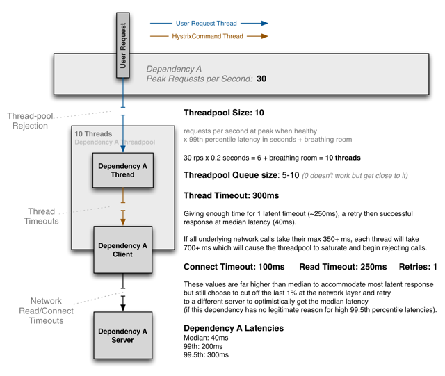
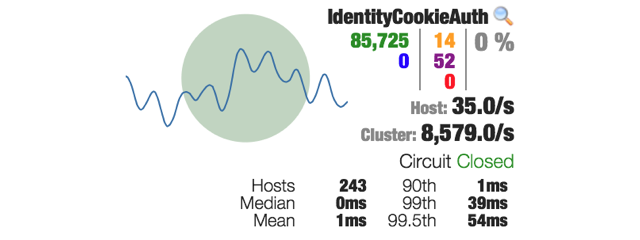
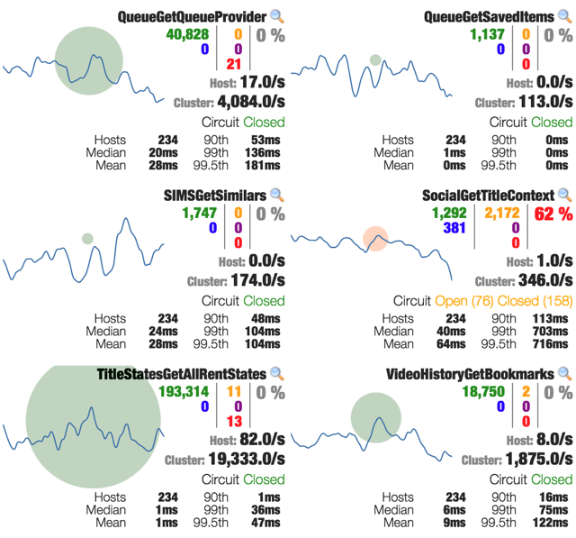
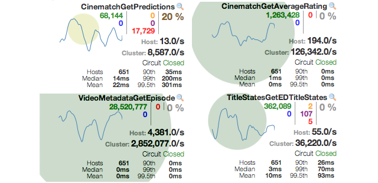
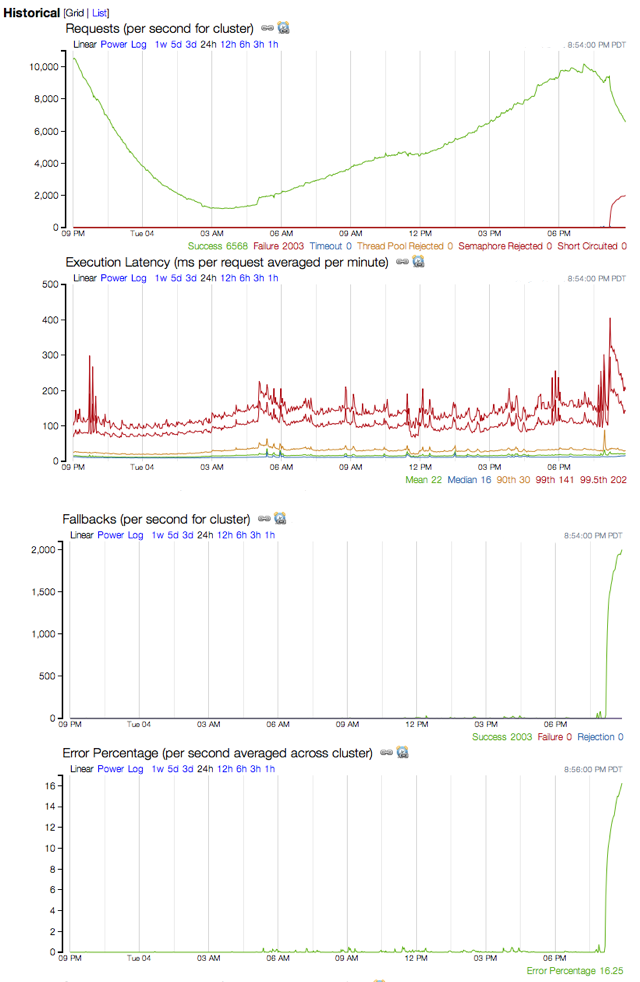
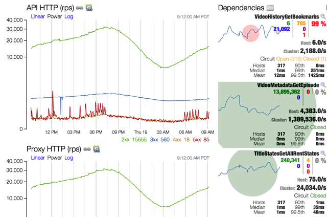
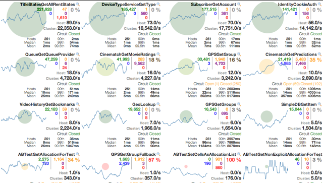
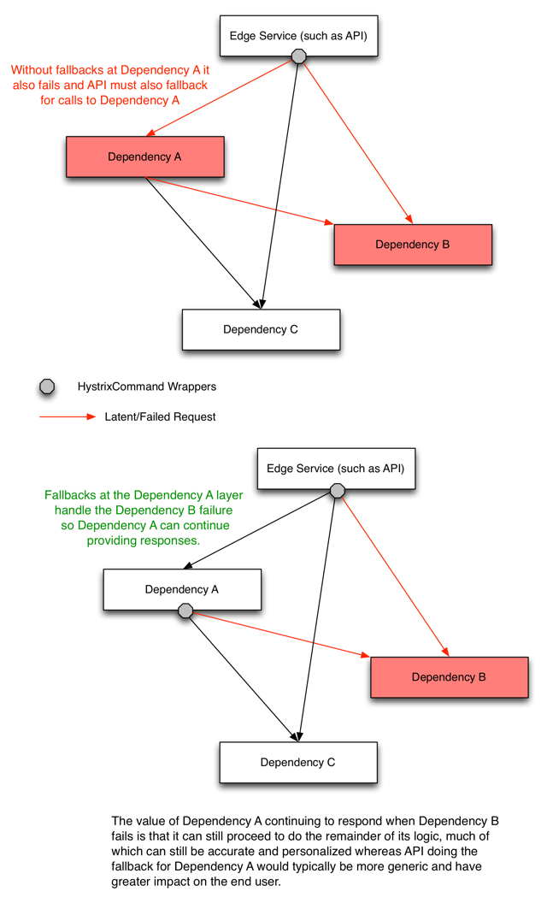
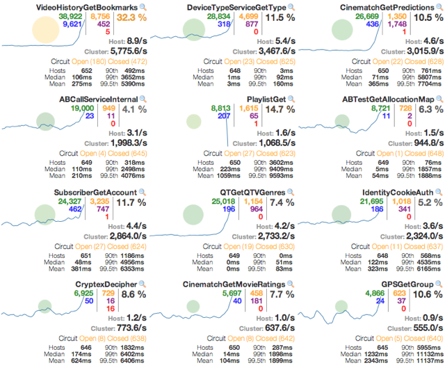

## Operations

Hystrix不仅是弹性工程的一个工具，也是操作的工具。

这个页面试图分享工作中的系统的一些经验教训，这些系统具有100多种Hystrix Command类型，40多个线程池，每天有超过10亿个线程隔离和2亿多个信号量隔离的命令执行。

本页上描述的屏幕截图和事件来自Netflix API系统，代表实际生产问题或针对生产的 [ Latency Monkey ](http://techblog.netflix.com/2011/07/netflix-simian-army.html)模拟。

### 如何配置和调整调用链

部署新调用链的典型方法是使用自由配置（超时/线程/信号量）将其释放到生产中，然后在看到其运行通过峰值生产周期后将其调整到更严格的配置。

在实践中，这通常看起来是：
1. 默认情况下保留1000毫秒超时，除非知道需要更多时间。
2. 让线程池默认为10个线程，除非知道需要更多的线程。
3. 部署到 canary; 如果一切都很好，继续。
4. 在生产环境运行24小时。
5. 依靠标准的警报和监控来捕获问题（如果有的话）。
6. 24小时后，使用延迟百分位数和流量来计算对调用链有意义的最低配置值。
7. 在生产中即时更改值，并使用实时仪表板监控它们，直到您有信心为止。
8. 如果调用链的特性或性能特性发生变化，并通过报警和/或仪表板监控引起您的注意，请再次查看该调用链的配置。

下图表示一个典型的思维过程，显示如何选择线程池，队列和执行超时（或信号量大小）的大小：

对于大多数调用链，您应该尝试将其超时值设置为接近正常健康系统的99.5百分位，以便它们可以截断不良请求，而不会让它们占用系统资源或影响用户行为。

您必须确定线程池和队列的大小，以便它们占总应用程序资源的很小百分比，否则它们将无法阻止依赖关系饱和可用资源。

配置和调整调用链的重要事项是：
* 你应该在生产中调整，并基于真实的流量模式
* 您可以在监视时实时地轻松调整设置，以查看不同设置的影响

### 预期波动和故障
Hystrix以毫秒粒度测量和报告指标。 这揭示了“波动” - 看作是超时，线程池拒绝，减速和其他这样的事情的突发。 在大的集群中，通常有一些事情发生在任何特定时间用于大容量调用链（cricuit）。

Hystrix捕获指标的粒度是许多软件系统没有的，因此这些报告可能会引起不必要的担心。

在来自Netflix API仪表板的截图中，您可以在生产中监视Hystrix命令，您可以在代表243个服务器的10秒统计窗口中看到显示超时和线程池拒绝的橙色和紫色数字。

大多数系统在相当高的水平上测量 - 即使分解为每分钟完成的百分位数延迟。 此外，它通常对整个应用程序请求循环，而不是每个单独的依赖关系进行交互。 在Hystrix，你可以得到一个更精细的视图，看看发生了什么。 一旦你有放大镜，显示了每个依赖关系发生了什么，不要惊讶地看到可能以前看不见的波动。

一些原因：

* 客户端机器垃圾收集（你的机器在一个请求的中间进行垃圾收集）
* 服务机器垃圾收集（远程服务器在向其请求的中间进行垃圾收集）
* 网络问题
* 不同请求参数的不同有效负载大小
* 缓存未命中
* 满负荷的请求模式
* 新机器启动（部署，自动缩放事件）和“预热”

### 当风险潜伏时

如果你注意到网络延时，不要通过跳转重新配置的东西做出反应。 如果一个Hystrix命令是卸载负载，它正在做它应该的（假设你正确配置它当它是健康的，当然 - 见上文）

在Hystrix被Netflix采用的早期，当一个调用链（我们内部称之为Hystrix [Observable] Command / CircuitBreaker配对）变成潜在的动态改变属性以增加线程池，队列，超时， 等等“尝试给它一些喘息的空间”，让它再次工作。 但这是你应该做的相反。 如果为健康系统正确配置了命令，并且现在拒绝，超时和/或短路，那么您应该集中精力修复根本的根本原因。

不要通过给予命令更多的资源，使它可以使用（在极端如果你的行为，通过增加线程池大小，队列，超时，信号量等DDOS自己的响应错误） 。

例如，假设您有一个100个服务器的集群，每个服务器具有10个允许服务的并发连接，即：1000个可能的并发连接。 当健康时，它通常使用200-300他们在任何给定的时间。 如果发生延迟并将其全部恢复，则现在使用1000个连接。 10每箱子似乎不太多的客户端，所以让我们尝试增加到20，对吧？ 很可能如果10饱和，20也将饱和。 现在你打开对后端的2000个连接，将会使事情变的更糟。

这是断路器存在的原因之一 - 在基础系统上“释放压力”，让它们恢复，而不是在重试循环，挂起连接等方面更多地请求它们。

例如，这里是单个依赖性的示例，其经历延迟，导致超时足够高以致断路器在大约三分之一的集群上跳闸。 它是系统中唯一具有健康问题的电路，Hystrix阻止其在遇到延迟问题时占用其他资源。

总之，让系统卸载，短路，超时和拒绝，直到底层系统再次健康，它会照顾自己，并在Hystrix层恢复健康。 Hystrix专为这种情况而设计，重点是减少潜在系统的资源利用率，以便通过保持大多数资源隔离并远离那些挂在潜在连接上的资源，可以快速恢复。

### 依赖失败看起来像什么

分布式系统中最典型的故障类型是单个依赖关系失败或变为潜在，而所有其他依赖关系保持健康。 在这些情况下，指标和仪表板在显示发生的事情中非常明显：

上面的屏幕截图显示了具有20％误差率的单个电路：足够高以具有影响但不足以开始使断路器跳闸。 其他三个电路不受影响。

在这个特定的例子中，它是导致问题的实际错误，而不是延迟，如红色数字而不是橙色所示。

在同一事件期间捕获了以下图表，以显示此调用链的历史趋势，以及其如何在故障和故障中飙升。

### 在依赖失败时fallback

这是一个影响单个调用链的另一个事件的屏幕截图。 注意，第99.5个百分位数的延迟非常高。 这是底层工作线程需要完成的时间，这反过来会使线程池饱和，并导致调用线程的超时。

集群中除一台机器外的所有机器都有断路器跳闸，这说明大多数流量都是短路（蓝色），而仍在尝试大多数请求的一台机器正在超时（橙色）。

注意，其他调用链是健康的，左边的线图表示没有返回500s的增加，因为这个调用链正在返回一个fallback，因此用户正在接收一个降级但仍然能使用的功能体验。

### 级联依赖失败

此屏幕截图表示单个系统的故障（在这种情况下为高延迟），严重依赖于许多其他系统，因此故障也在其间级联。 Netflix API系统必须能够抵御延迟和故障，而不仅仅是单一根本原因，而是所有受其影响的系统。

下面的截图显示了代表三种不同系统的六个调用链：

在这个事件发生的时候，Hystrix仍然主要是一个“Netflix-API-only”的东西。 随着Hystrix跨越越来越多的Netflix团队，这进一步限制了级联故障的影响，如下图所示：

### 当它是你，不是依赖

如果所有的调用链似乎坏（仪表板都亮起来），那么有一个很好的机会问题是你的系统，而不是所有的依赖在同一时间。

可导致此问题的系统问题的两个示例是：
* 系统过载（高负载平均，CPU使用等）
	* 可能发生这种情况的一个例子是，如果自动扩展策略失败或不能足够快地扩展到流量浪涌，并且机器正在接收更多的流量，他们可以处理。
* 内存泄漏，最终导致GC颠簸，这会窃取CPU并导致暂停，从而导致调用链超时，备份和拒绝